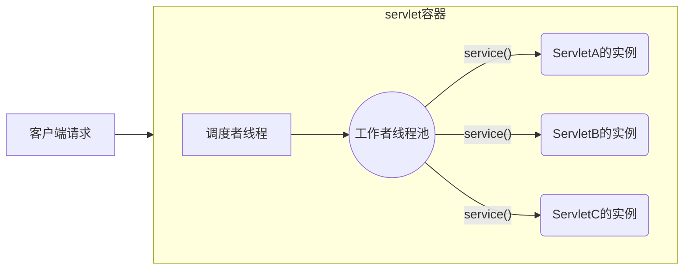

## Java-Web-基础😀

### 部署Java程序到Tomcat

#### 静态部署🎈

直接将编译后的项目文件夹或者war包放到webapps中

#### 动态部署🎈

```xml
<Context path="/test" docBase="project path" reloadable="true" />
```

- 直接将这插入到server.xml中host节点中
- %tomcat_home%/conf/enginename/hostname/，在这创建对应项目名的project-name.xml，并将上面内容拷贝到xml中(⚠️项目的上下文路径将以project-name为准，与Context节点的path无关)

### Servlet请求匹配规则

采用最长匹配，如果没有找到匹配的则调用容器默认的servlet处理，没有配置默认的servlet，则发送HTTP404消息

### 线程安全的Servlet

默认情况下，servlet是多线程的，即一个servlet实例在多个线程中同时执行，并发地处理多个客户端请求

<center>多线程的servlet执行模型</center>


#### 变量的线程安全

对于实例变量的访问，需要考虑并发的情况，同时对于connection在close()后，将其设置为null，避免在Connection Closed Exception

```java
public TestServlet extends HttpServlet {
    protected void service(req, res) {
        Connection conn = null;
        try {
            conn = ds.getConnection();
            conn.close();
            conn = null; // 确保不会关闭两次,避免并发时出现问题
        } finally {
            if (conn != null) {
                try {
                    conn.close();
                } catch(Exception e) {
                }
            }
        }
    }
}

```

#### 属性的线程安全

- ServletContext: 可以被Web应用程序中所有servlet访问，线程不安全
- HttpSession: 同属于一个进程的浏览器窗口，这些窗口的访问请求，属于同一个session，为了处理这些请求，Servlet容器会创建多个线程处理，线程不安全
- ServletRequest: Servlet对于接受到的每一个请求，都会创建一个新的ServletRequest对象，只能一个线程能访问当前的request，线程安全

#### RequestDispatcher

- 调用servletcontext的getRequestDispatcher方法，传入的路径参数必须以斜杠(/)开始，表示相对于上下文的路径
- 调用request的getRequestDispatcher方法，传入的路径参数没有以斜杠(/)开始，表示相对于当前servlet的路径

##### forward和include区别

- forward表示将执行的控制权转交给其它资源处理，其执行后，位于后面的代码不再被执行
- include表示将执行的控制权暂时转交给其它资源处理，同时其它资源作出的响应将并入原先的响应对象，原先的servlet的代码仍可继续执行，可继续输出响应信息

##### forward和sendRedirect区别

- forward: 在后台请求另外的资源去处理请求，对于浏览器来说不可见，同时浏览器的地址栏不会改变
- sendRedirect: 将对于其它资源的请求，再次转发给浏览器，由浏览器去请求其它的资源处理，浏览器的地址栏会发生改变
