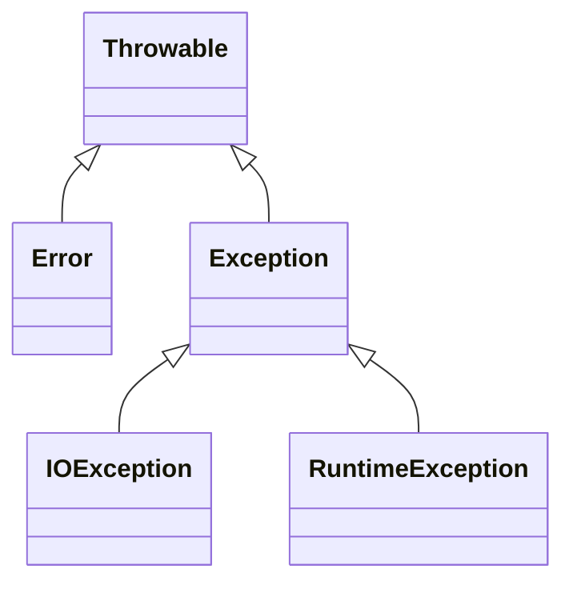

## 异常、断言和日志

### 处理错误

#### 异常分类

<center>Java中的异常层次结构</center>



#### 创建异常类

```java
class FileFormatException extends IOException {
    public FileFormatException() {}
    public FileFormatException(String gripe) {
        super(gripe)
    }
}
```

### 捕获异常

#### 捕获多个异常

```java
try {

} catch (FileNotFoundException | UnknownHostException e) {

} catch (IOException e) {

}
```

#### 再次抛出异常与异常链

```java
try {

} catch (SQLException e) {
    Throwable se = new ServletException("datebase error");
    se.initCause(e);
    throw se;
}
```

#### 带资源的try语句

```java
try (Resource res = ...) {

}
```

在try块退出时，会自动调用res.close方法。还可以自定义实现AutoCloseable接口的类，来实现带资源的try语句
